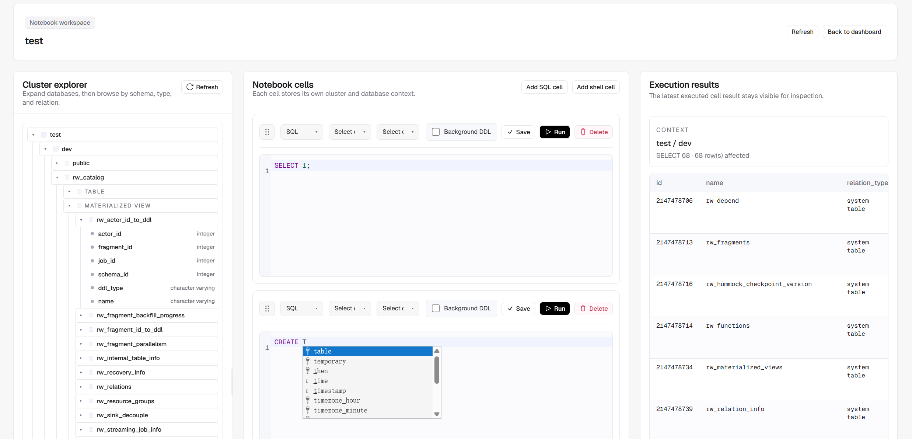

# WaveKit

WaveKit is a lightweight workspace for [RisingWave](https://risingwave.com/) clusters.



It gives you a simple UI to:

- [x] Browse cluster databases and relation metadata
- [x] SQL notebooks
- [ ] Built-in coding agent
- [ ] Streaming graph

## Quickstart

Run WaveKit with the bundled PostgreSQL image:

```bash
docker run -d -p 5677:5677 --name wavekit -v wavekit-data:/var/lib/postgresql cloudcarver/wavekit:v0.2.0-pgbundle
```

Then open:

- http://localhost:5677

The `cloudcarver/wavekit:v0.2.0-pgbundle` image includes WaveKit and PostgreSQL in one container. Application data is stored in the `wavekit-data` Docker volume.
